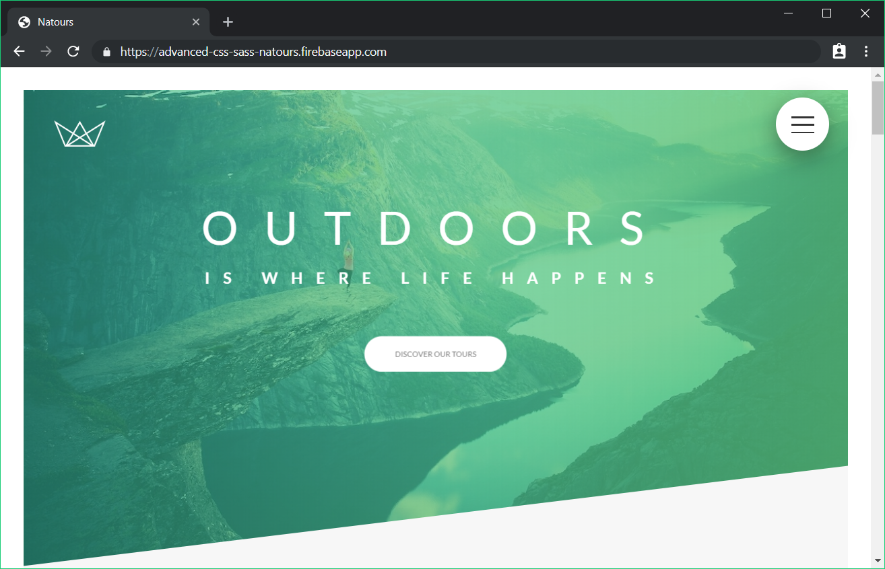

# Advanced-CSS-SASS-Course
 
 Showcase personal projects using advanced CSS and SASS, also document progress of the highly rated Udemy course taught by Jonas Schmedtmann.

 Topics covered: 
- Advanced CSS animations with @keyframes, animation and transition
- CSS behind the scenes: the cascade, specificity, inheritance, etc.
- CSS architecture: component-based design, BEM, writing reusable code, etc.
- Flexbox layouts: build a huge real-world project with flexbox
- CSS Grid layouts: build a huge real-world project with CSS Grid
- Using Sass in real-world projects: global variables, architecting CSS, managing media queries, etc.
- Advanced responsive design: media queries, mobile-first vs desktop-first, em vs rem units, etc.
- Responsive images in HTML and CSS for faster pageloads
- SVG images and videos in HTML and CSS: build a background video effect
- The NPM ecosystem: development workflows and building processes

## Showcased projects
The following project have been build in correspondence with the tutorials, and are deployed live with Firebase. Feel free to check them out.

### [Natours (Sass)](https://advanced-css-sass-natours.firebaseapp.com/)

<!-- - Responsive
- Animations, shadows,  -->

<!-- ### [Trillo]() -->
<!--  -->
